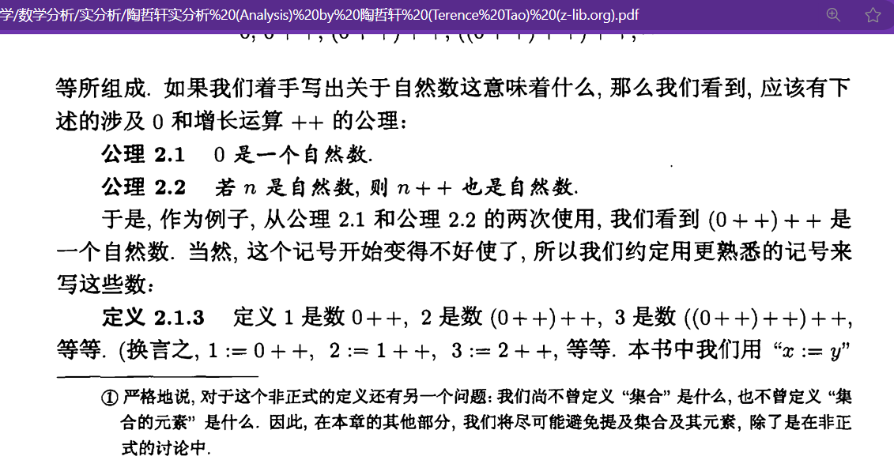

# The development of the world reflected in the history of mathematics

## Algebra

### 1:Abel transformation

$A_k=\sum_{i=1}^{k}a_i$      $B_k=\sum_{i=1}^{k}b_i$

$a_k=A_k-A_{k-1}$     $b_k=B_k-B_{k-1}$

$\begin{aligned}\Rightarrow\sum_{i=1}^{k}a_ib_i&=a_1b_1+a_2b_2+...+a_kb_k\\&=a_1(B_1)+a_2(B_2-B_1)+...a_k(B_k-B_{k-1})\\&=B_1(a_1-a_2)+...B_{k-1}(a_{k-1}-a_{k})+B_ka_k\\&=-\sum_{i=1}^{k-1}B_i(a_{i+1}-a_i)+a_kB_k\end{aligned}$

Similarly:$\sum_{i=1}^{k}a_ib_i=a_1b_1+a_2b_2+...+a_kb_k=-\sum_{i=1}^{k-1}A_i(b_{i+1}-b_i)+b_kA_k$

$\begin{aligned}\Rightarrow\sum_{i=1}^{k-1}[A_i(b_{i+1}-b_i)-B_i(a_{i+1}-a_i)]&=A_kb_k-B_ka_k\\\sum_{i=1}^{k-1}[A_ib_{i+1}-B_ia_{i+1}-(A_ib_{i}-B_ia_{i})]&=A_kb_k-B_ka_k\\\sum_{i=1}^{k-1} \begin{vmatrix}
 A_i&B_i\\a_{i+1}&b_{i+1}\end{vmatrix}-\sum_{i=1}^{k-1}\begin{vmatrix}
 A_i&B_i\\a_{i}&b_{i}\end{vmatrix}&=\begin{vmatrix}
 A_k&B_k\\a_{k}&b_{k}\end{vmatrix} \end{aligned}$

$def:$ $\Delta(a_{i+1})=a_{i+1}-a_{i}$          $\Delta(b_{i+1})=b_{i+1}-b_{i}$

​    $\Rightarrow\Delta(A_i)=A_{i}-A_{i-1}=a_i$       $\Delta(B_i)=B_{i}-B_{i-1}=b_i$ 

$\sum_{i=1}^{k}a_i\Delta(B_i)=b_kA_k-\sum_{i=1}^{k-1}A_i\Delta(b_{i+1})$

$Let$  $u=\Delta(B_i)=b_i$ , $v=A_i$,then $\Delta(v)=a_i$,$\Delta(b_{i+1})=\Delta(u)$

$\begin{aligned}&\Rightarrow\sum_{i=1}^ku\Delta(v)=uv-\sum_{i=1}^{k-1}v\Delta(u)\\&\simeq\int u\mathrm{d}v=uv-\int v\mathrm{d}u\end{aligned}\ $

### 2: Abstract algebra

#### [Group](https://mathworld.wolfram.com/Group.html)

#### [Ring](https://mathworld.wolfram.com/Ring.html)

#### [Field](https://mathworld.wolfram.com/FieldAxioms.html)

### 3:[Boolean algebra](https://encyclopedia.thefreedictionary.com/Boolean+algebra)

- Grey code

  

## Analysis

### [Peano's axioms](https://mathworld.wolfram.com/PeanosAxioms.html)

### [cantor set](https://mathworld.wolfram.com/CantorSet.html)

## Geometry

- [Topology](https://mathworld.wolfram.com/Topology.html)
- [Analytic geometry](https://encyclopedia.thefreedictionary.com/analytic+geometry)

