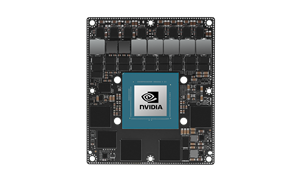
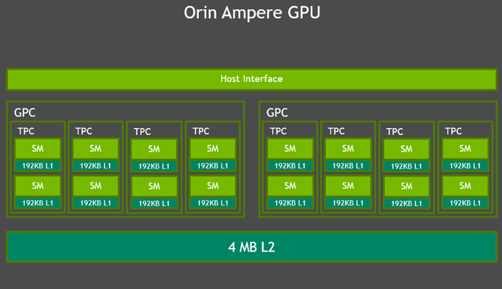
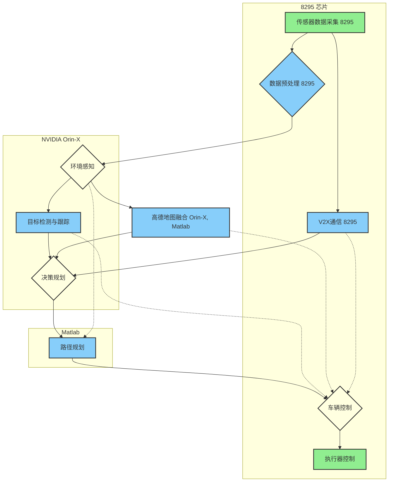

# 基于8295和Orin-X的智驾系统的设计6666test

## 高通 8295 芯片介绍

​    高通骁龙 8295 是一款功能强大的汽车芯片，在智能座舱和自动驾驶领域都具有重要的应用价值。8295 芯片的主要特点在于其高性能计算能力。它采用了先进的 CPU、GPU 和 AI 加速器架构。具体来说：

- ​    **CPU:** 搭载第六代 Qualcomm Kryo CPU，由 4 个超大核心和 4 个大核心组成，提供卓越的计算性能。这些核心可以根据不同的工作负载进行动态调整，以实现最佳的性能和能效平衡。
- ​    **GPU:** 配备第六代 Adreno GPU，其计算能力高达 2.9 万亿次单精度浮点运算/秒，甚至超越了 Apple M1 芯片的 GPU 性能。这使得 8295 芯片能够支持高分辨率显示、复杂的图形渲染和流畅的游戏体验，为用户带来极致的视觉享受。
- ​    **AI 处理能力:** 拥有强大的 AI 处理单元，即 Qualcomm Hexagon 处理器，支持多种 AI 算法和框架，例如 TensorFlow、PyTorch 等。其 AI 算力高达 30 TOPS，为高级自动驾驶功能，如物体检测、场景识别、路径规划等，奠定坚实的基础。

​    这种强大的计算能力为智能汽车的各种功能提供了强大的算力支持，包括多模态人机交互、复杂的环境感知和高精度的定位。


​    此外，8295 芯片在车载 AI 集成方面也表现出色。它能够高效地运行 AI 模型，从而显著提高人机交互的效率，使驾驶者和乘客能够更自然、更便捷地与车辆进行互动。例如，通过自然语言处理实现更加智能的语音控制，支持多轮对话、语音助手等功能；通过计算机视觉实现驾驶员状态监测，例如疲劳驾驶检测、注意力分散检测等，以及乘客行为识别，例如乘客数量统计、姿态识别等。这些功能可以提升驾驶安全性，改善乘车体验。

​    在应用方面，8295 芯片的应用范围非常广泛。它不仅可以用于开发先进的智能座舱系统，为用户提供沉浸式的多媒体体验和多样化的功能，如多屏互动、高保真音频处理，支持多声道环绕音效、音频个性化等，以及增强现实显示，例如 AR 导航、AR 仪表盘等。同时，它也支持 L1-L2+ 级别的自动驾驶功能，例如自动泊车、车道保持和自适应巡航等。更重要的是，8295 芯片还支持 5G 和 C-V2X 技术，能够实现车辆与外部环境的互联互通，包括车辆与车辆、车辆与基础设施、车辆与行人之间的通信，为实现更高级别的自动驾驶和构建未来的智能交通系统提供支持。

​    总而言之，高通骁龙 8295 芯片以其卓越的计算性能、强大的 AI 处理能力和全面的互联互通功能，正在成为高端汽车市场的主流选择，推动汽车智能化不断向前发展。随着汽车智能化程度的不断提高，8295 芯片将在未来的汽车中扮演越来越重要的角色。

## NVIDIA Orin-X介绍

NVIDIA® Jetson AGX Orin 系列提供服务器级性能，可提供高达 275 TOPS 的 AI 性能，为自主系统提 供动力。Jetson AGX Orin 系列包括 Jetson AGX Orin 64GB 和 Jetson AGX Orin 32GB 模块。这些节 能的系统级模块 (SOM) 与 Jetson AGX Xavier 外形尺寸和引脚兼容，并提供高达 8 倍的 AI 性能。Jetson AGX Orin 模块采用 NVIDIA Orin SoC，配备 NVIDIA Ampere 架构 GPU、Arm® Cortex®-A78AE CPU、下一代深度学习和视觉加速器以及视频编码器和视频解码器。高速 IO、204 GB/s 内存带宽和 32GB 或 64GB DRAM 使这些模块能够为多个并发 AI 应用程序管道提供支持。借助 SOM 设计，NVIDIA 完成了围绕 SoC 进行设计的繁重工作，不仅提供计算和 I/O，还提供电源和内存 设计。



### GPU

Jetson AGX Orin 模块包含一个集成的 Ampere GPU，由 2 个图形处理集群 (GPC)、最多 8 个纹理处 理集群 (TPC)、最多 16 个流式多处理器 (SM)、每个 SM 192 KB 的 L1 缓存和 4 MB 的 L2 缓存组成。 Ampere 每个 SM 有 128 个 CUDA 核心，而 Volta 有 64 个 CUDA 核心，每个 SM 有 4 个第三代 Tensor 核心。Jetson AGX Orin 64GB 有 2048 个 CUDA 核心和 64 个 Tensor 核心，最多 170 个稀疏 TOP 的 INT8 Tensor 计算，以及最多 5.3 FP32 TFLOP 的 CUDA 计算。



#### 第三代张量核和稀疏性

NVIDIA Tensor 核心提供加速下一代 AI 应用所需的性能。Tensor 核心是可编程的融合矩阵乘法和累加 单元，可与 CUDA 核心同时执行。Tensor 核心实现浮点 HMMA（半精度矩阵乘法和累加）和 IMMA （整数矩阵乘法和累加）指令，用于加速密集线性代数计算、信号处理和深度学习推理。

Ampere 为第三代 Tensor 核心提供支持，从而支持 16x HMMA、32x IMMA 和新的稀疏性功能。借助 稀疏性功能，客户可以利用深度学习网络中的细粒度结构化稀疏性，使 Tensor 核心操作的吞吐量翻倍。 稀疏性被限制为每 4 个权重中有 2 个非零。它使 Tensor 核心能够跳过零值，使吞吐量翻倍并显著减少 内存存储。可以先在密集权重上训练网络，然后进行修剪，然后在稀疏权重上进行微调

#### 利用 NVIDIA 软件库充分利用 Ampere GPU

客户可以使用 NVIDIA TensorRT 和 cuDNN 加速 GPU 上的推理。NVIDIA TensorRT 是一个用于深度 学习推理的运行时库和优化器，可在 NVIDIA GPU 产品中提供更低的延迟和更高的吞吐量。TensorRT 使客户能够解析经过训练的模型，并通过将模型量化为 INT8 来最大化吞吐量，通过融合内核中的节点 来优化 GPU 内存和带宽的使用，并根据目标 GPU 选择最佳数据层和算法。 cuDNN（CUDA 深度神经网络库）是一个 GPU 加速的深度神经网络基元库。它提供了 DNN 应用中常 见的例程的高度优化实现，例如前向和后向卷积、互相关、前向和后向池化、前向和后向 softmax、张 量变换函数等。借助 Ampere GPU 和 NVIDIA 软件堆栈，客户能够处理每天都在发明的新型复杂神经 网络

### DLA

 NVIDIA 深度学习加速器 (DLA) 是一款针对深度学习操作优化的固定功能加速器。它旨在对卷积神经 网络推理进行全硬件加速。Orin SoC 支持下一代 NVDLA 2.0，其性能是 NVDLA 1.0 的 9 倍。 DLA 2.0 提供了高度节能的架构。借助这种新设计，NVIDIA 增加了本地缓冲，从而提高了效率并减少了 DRAM 带宽。DLA 2.0 还带来了一组新功能，包括结构化稀疏性、深度卷积和硬件调度程序。这使得 Jetson AGX Orin DLA 上的总 INT8 稀疏 TOP 达到 105，而 Jetson AGX Xavier DLA 上的总 INT8 密 集 TOPS 达到 11.4。

### TensorRT 支持

客户可以使用 TensorRT 在 DLA 上加速他们的模型，就像在 GPU 上一样。NVIDIA DLA 旨在从 GPU 卸载深度学习推理，使 GPU 能够运行更复杂的网络和动态任务。TensorRT 支持在 DLA 上运行 INT8 或 FP16 网络，并支持各种层，例如卷积、反卷积、全连接、 激活、池化、批量规范化等。有关 TensorRT 中 DLA 支持的更多信息，请参见：使用 DLA。NVIDIA DLA 支持多种模型和算法，以实现 3D 构建、路径规划、语义理解等。根据所需的计算类型，可以使用 DLA 和 GPU 来实现完整的应用程序加速。

### 性能的巨大飞跃

借助 GPU 和 DLA 增强功能，Jetson AGX Orin 系列在性能上实现了巨大飞跃。机器人技术的新时代正 在兴起，多传感器感知、地图绘制和定位、路径规划和控制、态势感知和安全等功能的计算需求呈数量 级增长。 尤其是机器人技术和其他边缘 AI 应用需要更多 AI 来实现计算机视觉和对话式 AI。从我们的预训练模 型可以看出，Jetson AGX Orin 模块在现实世界 AI 应用上的性能是 Jetson AGX Xavier 的 3.3 倍。我 们预计，随着未来的软件更新，性能将提高近 5 倍。

### CPU

对于 Jetson AGX Orin 系列模块，我们从 NVIDIA Carmel CPU 迁移到了 Arm Cortex-A78AE。Orin CPU 集群最多有 12 个 CPU 核心。每个核心包括 64KB 指令 L1 缓存和 64KB 数据缓存，以及 256 KB 的 L2 缓存。与 Jetson AGX Xavier 一样，每个集群也具有 2MB L3 缓存。最高支持 CPU 频率 2.2 GHz。

Jetson AGX Orin 64GB 上的 12 核 CPU 的性能几乎是 Jetson AGX Xavier 上的 8 核 NVIDIA Carmel CPU 的 1.9 倍。客户可以利用 Cortex-A78AE 的增强功能（包括更高的性能和增强的缓存）来优化其 CPU 实现。

### 内存和存储

Jetson AGX Orin 模块支持 1.4 倍的内存带宽和 2 倍的 Jetson AGX Xavier 存储，可实现 32GB 或 64GB 的 256 位 LPDDR5 和 64 GB 的 eMMC。DRAM 支持的最大时钟速度为 3200 MHz，每个引脚 6400 Gbps，可实现 204.8 GB/s 的内存带宽。图 8 突出显示了各个组件如何与内存控制器结构和 DRAM 交互。

### 视频编解码器

Jetson AGX Orin 模块包含一个多标准视频编码器 (NVENC)、一个多标准视频解码器 (NVDEC) 和一 个 JPEG 处理块 (NVJPEG)。NVENC 为各种编码标准（包括 H.265、H.264 和 AV1）提供全硬件加 速。NVDEC 为各种解码标准（包括 H.265、H.264、AV1、VP9）提供全硬件加速。NVJPG 负责 JPEG（解）压缩计算（基于 JPEG 静态图像标准）、图像缩放、解码（YUV420、YUV422H/V、 YUV444、YUV400）和色彩空间转换（RGB 到 YUV）。请参阅 Jetson AGX Orin 系列数据表，了 解完整的标准列表。客户可以利用 NVIDIA Jetson 的多媒体 API 为这些引擎提供支持。多媒体 API 是一组低级 API，支持跨这些引擎 进行灵活的应用程序开发。

### 聚乙烯醇和乙烯基

Jetson AGX Orin 模块支持我们的下一代可编程视觉加速器引擎 PVA v2。PVA 引擎包括双 7 路 VLIW （超长指令字）矢量处理单元、双 DMA 引擎和一个 Cortex-R5 子系统。PVA 支持各种计算机视觉内 核，例如过滤、扭曲、图像金字塔、特征检测和 FFT。使用 PVA 的一些常见计算机视觉应用包括特征检 测器、特征跟踪器、对象跟踪器、立体视差和视觉感知。

Orin SoC 还包含 Gen 4.2 视频图像合成器 (VIC) 2D 引擎。VIC 支持各种图像处理功能，例如镜头失 真校正和增强的时间降噪、视频功能（例如清晰度增强）以及常规像素处理功能（例如色彩空间转换、 缩放、混合和合成）。 视觉编程接口 (VPI) 是一个软件库，可在多个 NVIDIA Jetson 硬件组件（包括 PVA、VIC、CPU 和 GPU）上实现计算机视觉和图像处理算法。借助 PVA 和 VIC 上的 VPI 算法支持，可以将计算机视觉和 图像处理任务分流给它们，并优先使用 CPU 和 GPU 执行其他任务。

例如，使用 VPI 的完整立体视差估计管道可以高效使用多个后端，包括 VIC、PVA 和 NVENC。管道接 收来自立体摄像机的输入，即立体对的左图像和右图像。VIC 处理此输入以校正镜头失真并缩小图像， 从而产生校正后的立体对。然后，使用 GPU 将图像从彩色转换为灰度，并将结果输入到使用 PVA 和 NVENC 作为后端的一系列操作中。输出是输入图像之间视差的估计值，这与场景深度有关。

VPI 带有多种算法，从图像处理构建块（如框过滤、卷积、图像重新缩放和重新映射）到更复杂的计算 机视觉算法（如 Harris 角点检测、KLT 特征跟踪器、光流、背景减法等）。请查看此处的 VPI 网络研讨 会，了解有关使用 VPI 加速计算机视觉应用的更多信息。

### I/O

 Jetson AGX Orin 系列模块包含大量高速 I/O，包括 22 条 PCIe Gen4 通道、千兆以太网、1 个用于 10 千兆以太网的 XFI 接口、一个显示端口、16 条 MIPI CSI-2 通道、USB3.2 接口以及各种其他 I/O，如 I2C、I2S、SPI、CAN、GPIO、USB 2.0、DMIC 和 DSPK。客户可以利用 UPHY 通道用于 USB 3.2、 UFS、PCIe 和 MGBE，并且一些 UPHY 通道在这些接口之间共享。所有 22 条 PCIe 通道都支持根端口 模式，一些通道也支持端点模式。显示端口可以使用 DP1.4 上的多流模式支持 2 个显示器。Jetson 可用 于具有各种 I/O 要求的各种应用程序。例如，自主地面车辆可以利用 CSI 摄像头来观察机器人周围的情 况，利用 I2S 来发出语音命令，利用 HDMI 来显示，利用 PCIe 来连接 Wi-Fi，利用 GPIO 和 IC 等等。 像十字路口的交通管理这样的视频分析应用可能需要许多 GigE 摄像头和以太网来实现联网目的。随着自 主机器继续执行更高级的任务，需要更多的 I/O 来连接更多的传感器。

## 系统设计




### 代码编写

```matlab
function main_controller_fuzzy_nn_output()
    % 仿真参数
    gridSize = [10, 10];
    numSteps = 20;           % 总时间步数
    start = [1,1];
    goal = [10,10];
    obstacleProbability = 0.2;  % 障碍物生成概率
    
    figure;
    for t = 1:numSteps
        % ---------- 动态障碍环境 ----------
        grid = zeros(gridSize);
        % 随机生成障碍物（起点和终点保留空白）
        for i = 1:gridSize(1)
            for j = 1:gridSize(2)
                if ~(i==start(1) && j==start(2)) && ~(i==goal(1) && j==goal(2))
                    if rand() < obstacleProbability
                        grid(i,j) = 1;
                    end
                end
            end
        end
        
        % ---------- 路径规划（A*） ----------
        path = Astar(grid, start, goal);
        if isempty(path)
            smoothPath = [];
        else
            % 翻转为正序路径
            path = flipud(path);
            % ---------- 路径平滑（利用前馈神经网络） ----------
            smoothPath = nn_smooth_path(path);
        end
        
        % ---------- 模糊控制 ----------
        % 这里模拟计算车辆与平滑路径之间的偏差
        if ~isempty(smoothPath)
            % 例如取路径中点与车辆当前位置的误差作为控制依据
            midIdx = floor(size(smoothPath,1)/2);
            targetPoint = smoothPath(midIdx, :);
            % 误差计算（当前车辆假设位于起点，实际中应更新车辆状态）
            errorVal = targetPoint(1) - start(1); 
            deltaErrorVal = targetPoint(2) - start(2);
            commands = fuzzy_vehicle_control(errorVal, deltaErrorVal);
        else
            commands = struct('Steering', NaN, 'Acceleration', NaN);
        end
        
        % ---------- 输出到命令行窗口 ----------
        fprintf('Time step: %d, Steering: %.2f, Acceleration: %.2f\n', ...
                t, commands.Steering, commands.Acceleration);
        
        % ---------- 绘制结果 ----------
        imagesc(grid);
        colormap(flipud(gray));  % 翻转颜色映射
        hold on;
        plot(start(2), start(1), 'go', 'MarkerSize', 10, 'LineWidth', 2);
        plot(goal(2), goal(1), 'ro', 'MarkerSize', 10, 'LineWidth', 2);
        if ~isempty(smoothPath)
            plot(smoothPath(:,2), smoothPath(:,1), 'b-', 'LineWidth', 2);
        end
        title({['Time step: ', num2str(t)], ...
               ['模糊控制指令：转向=', num2str(commands.Steering), ...
                ' 加速=', num2str(commands.Acceleration)]});
        xlabel('X'); ylabel('Y');
        hold off;
        pause(0.5);
    end
end

%% A*路径规划函数
function path = Astar(grid, start, goal)
    openList = [];
    closedList = zeros(size(grid));
    
    % 初始化起点节点
    node.parent = [];
    node.position = start;
    node.g = 0;
    node.h = heuristic(start, goal);
    node.f = node.g + node.h;
    openList = [node];
    
    while ~isempty(openList)
        [~, idx] = min([openList.f]);
        current = openList(idx);
        openList(idx) = [];
        closedList(current.position(1), current.position(2)) = 1;
        
        if isequal(current.position, goal)
            path = reconstruct_path(current);
            return;
        end
        
        neighbors = get_neighbors(current.position, grid);
        for i = 1:size(neighbors,1)
            neighborPos = neighbors(i,:);
            if closedList(neighborPos(1), neighborPos(2)) == 1
                continue;
            end
            
            neighbor.g = current.g + norm(neighborPos - current.position);
            neighbor.h = heuristic(neighborPos, goal);
            neighbor.f = neighbor.g + neighbor.h;
            neighbor.position = neighborPos;
            neighbor.parent = current;
            
            skip = false;
            for j = 1:length(openList)
                if isequal(openList(j).position, neighbor.position) && openList(j).f <= neighbor.f
                    skip = true;
                    break;
                end
            end
            if ~skip
                openList = [openList, neighbor];
            end
        end
    end
    
    path = [];
    disp('未找到路径');
end

function h = heuristic(pos, goal)
    h = sqrt((pos(1)-goal(1))^2 + (pos(2)-goal(2))^2);
end

function neighbors = get_neighbors(pos, grid)
    moves = [-1,0; 1,0; 0,-1; 0,1];
    neighbors = [];
    for i = 1:size(moves,1)
        newPos = pos + moves(i,:);
        if newPos(1) >= 1 && newPos(1) <= size(grid,1) && ...
           newPos(2) >= 1 && newPos(2) <= size(grid,2) && grid(newPos(1), newPos(2)) == 0
            neighbors = [neighbors; newPos];
        end
    end
end

function path = reconstruct_path(node)
    path = [];
    current = node;
    while ~isempty(current)
        path = [path; current.position];
        if isfield(current, 'parent')
            current = current.parent;
        else
            break;
        end
    end
end

%% 神经网络平滑函数（利用前馈网络）
function smoothPath = nn_smooth_path(path)
    % 转置数据：每列为一个样本
    dataX = path';
    % 目标平滑效果（示例中用移动平均模拟平滑效果）
    target = movmean(path, 3, 1)';
    
    % 构建前馈神经网络，隐藏层节点数为10
    net = feedforwardnet(10);
    net.trainParam.showWindow = false;  % 关闭训练窗口
    net = train(net, dataX, target);
    
    % 使用训练好的网络进行预测
    smoothData = net(dataX);
    smoothPath = smoothData';
end

%% 模糊控制函数（多输入输出系统）
function commands = fuzzy_vehicle_control(errorVal, deltaErrorVal)
    % 构建一个简单的Mamdani模糊推理系统
    fis = mamfis('Name','VehicleControlFuzzy');
    
    % 添加输入变量：误差与误差变化率
    fis = addInput(fis, [-10 10], 'Name', 'Error');
    fis = addInput(fis, [-20 20], 'Name', 'DeltaError');
    
    % 添加输出变量：转向与加速指令
    fis = addOutput(fis, [-30 30], 'Name', 'Steering');
    fis = addOutput(fis, [-3 3], 'Name', 'Acceleration');
    
    % 定义输入隶属函数（Error）
    fis = addMF(fis, 'Error', 'trimf', [-10 -5 0], 'Name', 'Negative');
    fis = addMF(fis, 'Error', 'trimf', [-5 0 5], 'Name', 'Zero');
    fis = addMF(fis, 'Error', 'trimf', [0 5 10], 'Name', 'Positive');
    
    % 定义输入隶属函数（DeltaError）
    fis = addMF(fis, 'DeltaError', 'trimf', [-20 -10 0], 'Name', 'Negative');
    fis = addMF(fis, 'DeltaError', 'trimf', [-10 0 10], 'Name', 'Zero');
    fis = addMF(fis, 'DeltaError', 'trimf', [0 10 20], 'Name', 'Positive');
    
    % 定义输出隶属函数（Steering）
    fis = addMF(fis, 'Steering', 'trimf', [-30 -15 0], 'Name', 'Left');
    fis = addMF(fis, 'Steering', 'trimf', [-15 0 15], 'Name', 'Straight');
    fis = addMF(fis, 'Steering', 'trimf', [0 15 30], 'Name', 'Right');
    
    % 定义输出隶属函数（Acceleration）
    fis = addMF(fis, 'Acceleration', 'trimf', [-3 -1.5 0], 'Name', 'Brake');
    fis = addMF(fis, 'Acceleration', 'trimf', [-1.5 0 1.5], 'Name', 'Maintain');
    fis = addMF(fis, 'Acceleration', 'trimf', [0 1.5 3], 'Name', 'Accelerate');
    
    % 定义模糊规则
    % 规则格式：[Error, DeltaError, Steering, Acceleration, Weight, Operator]
    ruleList = [...
        1 1 1 1 1 1;   % 若误差和误差变化均为Negative，则向左并减速
        2 2 2 2 1 1;   % 若均为Zero，则保持直行和速度
        3 3 3 3 1 1;   % 若误差和误差变化均为Positive，则向右并加速
        1 2 1 1 1 1;   % 误差Negative但变化为Zero时，向左并轻微减速
        3 2 3 3 1 1;   % 误差Positive但变化为Zero时，向右并轻微加速
    ];
    fis = addRule(fis, ruleList);
    
    % 评估模糊系统
    output = evalfis(fis, [errorVal, deltaErrorVal]);
    commands = struct('Steering', output(1), 'Acceleration', output(2));
end

```

